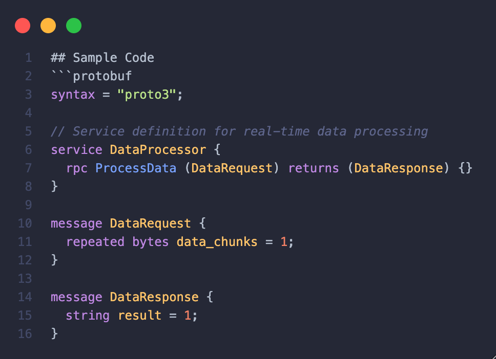

# Title
2. Implementing gRPC for Real-Time Data Processing

## Context
Q: What is the issue that we're seeing that is motivating this decision or change?

A: **Our project requires real-time data processing capabilities to handle large volumes of data efficiently. We need a technology that can support this requirement.**

## Decision
Q: What is the solution that we're proposing and/or doing?

- **Implement gRPC for real-time data processing between services.**
- **Leverage gRPC's bidirectional streaming for efficient data transfer.**

## Rationale
Q: Why do we choose this solution?

**A: We choose this solution for several reasons:**
- **Real-time Processing:** gRPC's bidirectional streaming allows for real-time data processing, enabling us to handle large volumes of data efficiently.
- **Efficiency:** gRPC's efficient serialization and multiplexing support improve performance for real-time applications.
- **Scalability:** gRPC's support for HTTP/2 enables scalable and reliable communication for real-time data processing.

## Consequences
Q: Pros – What becomes easier?

### Pros
- Real-time data processing capabilities.
- Improved performance and efficiency for handling large volumes of data.
- Scalable and reliable communication for real-time applications.

Q: Cons – What becomes more difficult?

### Cons
- Requires careful design to manage state and ensure data consistency.
- Increased complexity in error handling and fault tolerance for real-time processing.

## Sample code
Give some sample code related to this decision.

